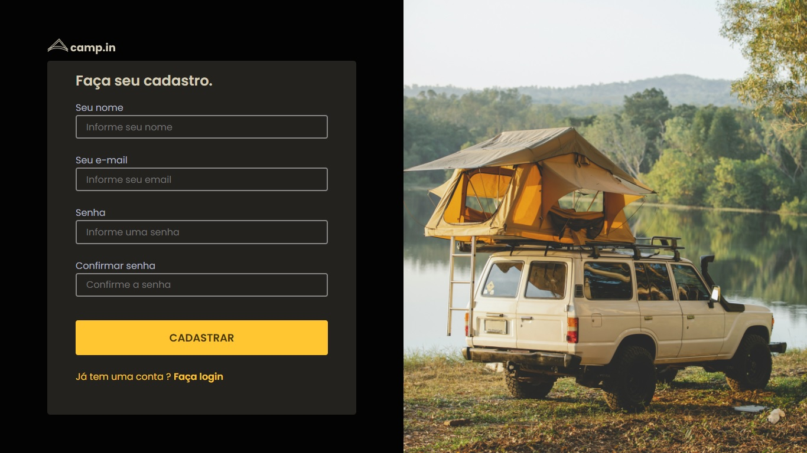

<h1 align="center">
  
</h1>

  

<h2>🏕️ Objetivo</h2>

O principal objetivo ao construir o site do camp.in foi aplicar na prática os conhecimentos adquiridos em relação a validação de formulários, utilizando um formulário de cadastro de clientes para isso. Além disso, o projeto foi útil para treinar código HTML e CSS, replicando um design feito no Figma.

 
<h2>🚀 Tecnologias utilizadas</h2>
<ul>
  <li>HTML</li>
  <li>CSS</li>
  <li>Javascript</li>
  <li>Biblioteca SweetAlert2</li>
</ul>
 
<h2>📌 Melhorias a serem implementadas</h2>
<ul>
  <li>Deixar o site responsivo para dispositivos móveis - Ok ✔️</li>
  <li>Continuar o projeto, construção das próximas páginas. Definir a finalidade do site</li>
  <li>Criar a autenticação do login do usuário</li>
</ul>
 
<h2>🏷️ Layout</h2>

Você pode visualizar o layout do projeto através deste link: <a href="https://www.figma.com/file/SX8XFyC5fAY09ai8Oykz0T/DD-%2F-Login-Form---CSS/duplicate">Layout do projeto</a>. É necessário possuir uma conta no <a href="https://figma.com">Figma</a> para acessá-lo.

 
 

Made by Matheus Pazinati 🛸
